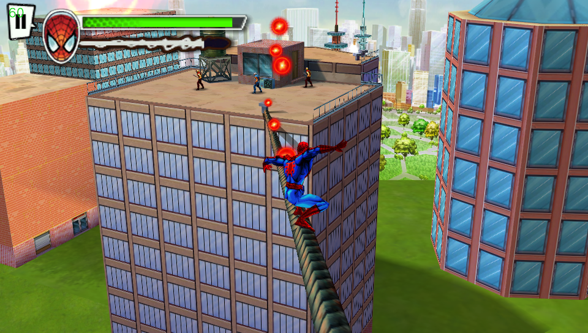

# Ultimate Spider-Man: Total Mayhem Vita

<p align="center"></p>

This is a wrapper/port of <b>Ultimate Spider-Man: Total Mayhem</b> for the *PS Vita*.

The port works by loading the official Android/Xperia ARMv6/Armv7 executable in memory, resolving its imports with native functions and patching it in order to properly run.
By doing so, it's basically as if we emulate a minimalist Android environment in which we run natively the executable as is.

## Changelog

### v1.2

- Implemented audio emitters. Now some missing sound effects will properly play.
- Rewrote the audio backend to use SDL Mixer Extended in place of SoLoud. This should be more reliable and cause audio cuts with less frequency.
- Replaced the bugged bootscreen with a handcrafted recreated one with proper scaling.
- Restored specular/reflection effects.

### v1.1

- Fixed wrong mapping for SELECT and START that were swapped.
- Improved input code logic.
- Improved audio code logic.
- Untied framerate (now game logic will run at 60 FPS instead of 30).
- Disabled debug mode in the video player.

### v1.0

- Initial release.

## Note

This port works with both the Android and Xperia build of the game. In order to achieve the best result, it's highly recommended to use the Xperia build of the game (v.1.00) since it has native physical buttons support. Android build will also have physical buttons support though limited since implemented via fake touch inputs.
It is also suggested to follow the extra paragraph on how to use HD assets from the Android build on the Xperia build.

## Setup Instructions (For End Users)

In order to properly install the game, you'll have to follow these steps precisely:

- Install [kubridge](https://github.com/TheOfficialFloW/kubridge/releases/) and [FdFix](https://github.com/TheOfficialFloW/FdFix/releases/) by copying `kubridge.skprx` and `fd_fix.skprx` to your taiHEN plugins folder (usually `ux0:tai`) and adding two entries to your `config.txt` under `*KERNEL`:
  
```
  *KERNEL
  ux0:tai/kubridge.skprx
  ux0:tai/fd_fix.skprx
```

**Note** Don't install fd_fix.skprx if you're using rePatch plugin

- **Optional**: Install [PSVshell](https://github.com/Electry/PSVshell/releases) to overclock your device to 500Mhz.
- Install `libshacccg.suprx`, if you don't have it already, by following [this guide](https://samilops2.gitbook.io/vita-troubleshooting-guide/shader-compiler/extract-libshacccg.suprx).
- Obtain your copy of *Ultimate Spider-Man: Total Mayhem* legally for Android or Sony Xperia Play in form of an `.apk` file and an `.obb` file. [You can get all the required files directly from your phone](https://stackoverflow.com/questions/11012976/how-do-i-get-the-apk-of-an-installed-app-without-root-access) or by using an apk extractor you can find in the play store.
- Open the apk with your zip explorer and extract the file `libspiderman.so` from the `lib/armeabi-v7a` or `lib/armeabi` folder to `ux0:data/spiderman`. 
- Open the obb with your zip explorer and extract the `gameloft` folder inside it in `ux0:data/spiderman`.

## How to use HD assets on Xperia build

- Extract the files `entities.pack`, `levelnew_01.pack`, `levelnew_02.pack`, `levelnew_03.pack`, `levelnew_04.pack`, `levelnew_05.pack`, `levelnew_06.pack`, `levelnew_07.pack`, `levelnew_08.pack`, `levelnew_09.pack`, `levelnew_10.pack`, `levelnew_11.pack`, `levelnew_12.pack` from the Android `.obb` file (located in `gameloft/games/GloftSMHP`) inside `ux0:data/spiderman/gameloft/games/spiderman` and confirm when asked to replace files.

## How to get intro video to properly play

- It is suggested to transcode the video with Handbrake: https://handbrake.fr/
- Import `ux0:data/spiderman/gameloft/games/spiderman/logo.mp4` into Handbrake.
- Set 'Preset:' to Fast 480p30
- Under 'Summary' tab set 'Format' to MP4
- Under 'Video' tab, set 'Framerate' to 30 and Constant Framerate
- In 'Save As' field, set file extension to .mp4
- Click 'Start Encode' to proceed
- Replace the original file with the newly transcoded one.

## Build Instructions (For Developers)

In order to build the loader, you'll need a [vitasdk](https://github.com/vitasdk) build fully compiled with softfp usage.  
You can find a precompiled version here: https://github.com/vitasdk/buildscripts/actions/runs/1102643776.  
Additionally, you'll need these libraries to be compiled as well with `-mfloat-abi=softfp` added to their CFLAGS:

- [SoLoud](https://github.com/vitasdk/packages/blob/master/soloud/VITABUILD)

- [libmathneon](https://github.com/Rinnegatamante/math-neon)

  - ```bash
    make install
    ```

- [vitaShaRK](https://github.com/Rinnegatamante/vitaShaRK)

  - ```bash
    make install
    ```

- [kubridge](https://github.com/TheOfficialFloW/kubridge)

  - ```bash
    mkdir build && cd build
    cmake .. && make install
    ```

- [vitaGL](https://github.com/Rinnegatamante/vitaGL)

  - ````bash
    make SOFTFP_ABI=1 NO_DEBUG=1 CIRCULAR_VERTEX_POOL=2 USE_SCRATCH_MEM=1 PHYCONT_ON_DEMAND=1 install
    ````

After all these requirements are met, you can compile the loader with the following commands:

```bash
mkdir build && cd build
cmake .. && make
```

## Credits

- TheFloW for the original .so loader and initial port of the game.
- hatoving for the Livearea assets.
- CatoTheYounger for testing the homebrew and providing screenshots.
